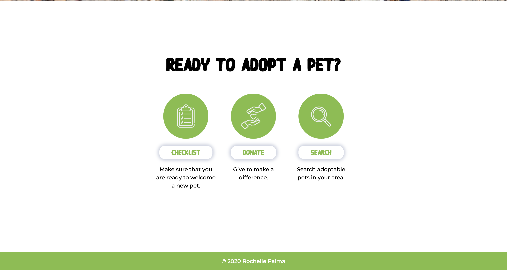
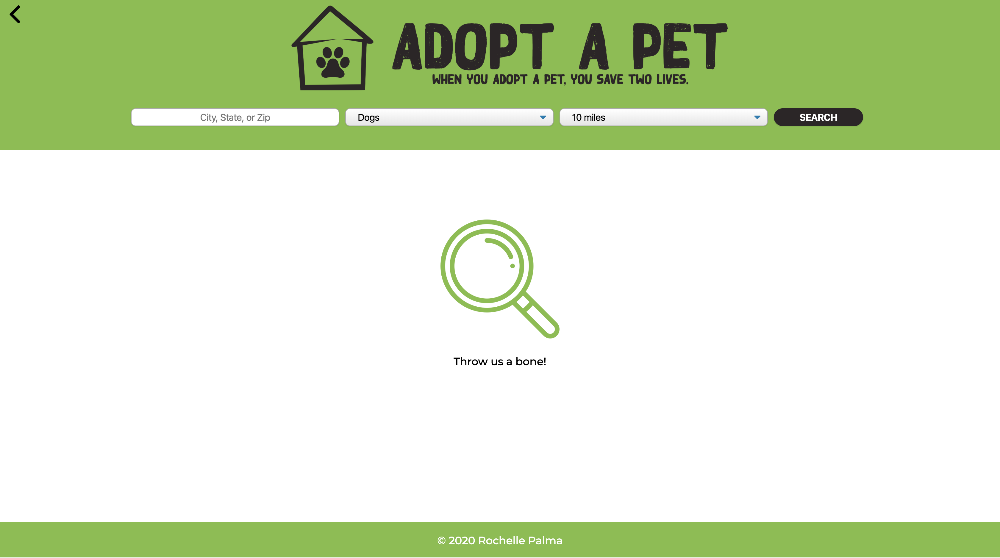
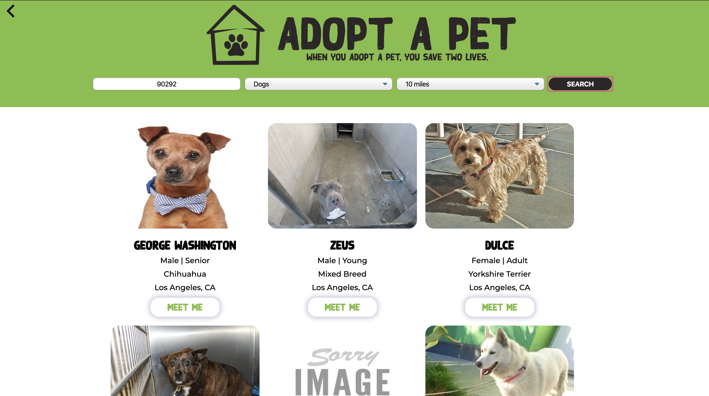
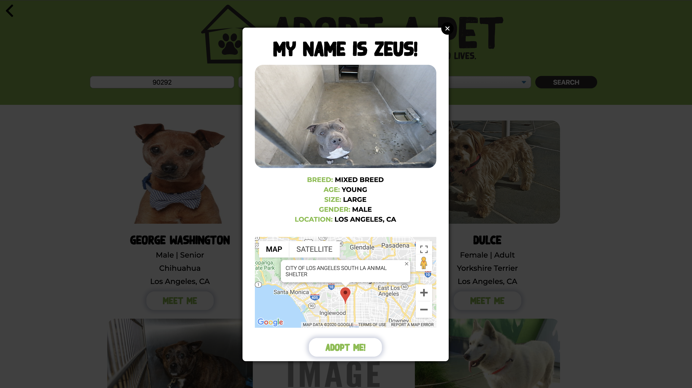

# Adopt a Pet
This app would help users locate adoptable pet in a given area. 

## [Live Site] (https://rochpalma.github.io/adopt-a-pet-app/)

## Introduction
I’m a big lover of animals that’s why I came up with this Adopt a Pet app for my project. I wanted a way for users to search for adoptable pets in need of forever home. This will also promotes the idea of supporting pet adoption that when you adopt, you save a loving animal and open up shelter space for another animal that might desperately need it.

## Summary
Adopt a Pet was designed for a pet lover. The user can navigate to Checklist using "Checklist" button to see if they are ready for adoption. If they’re not and the user still wants to help animals in need then they can just support them by donating,they will be redirected to donation page by clicking "Donate" button. And if they really are ready to commit for pet adoption and want to search for adoptable pets, the user can navigate to the search page. User will enter a zip code or the city and State, then select what type of pet and how far they are willing to travel for the distance. The search button is clicked, if the user enters a valid location it will display the list of pets in the page. If the user selects the pet it will give them the pet information with the map. The adopt me button will take the user to the contact form for the inquiry.

## Technology Used
Adopt a Pet uses PetFinder API to access adoptable pet’s information including the shelter location, and uses Google Maps and Geocoding API to display the shelter location on an interactive map.
The app is written using:
* HTML
* CSS
* JavaScript
* jQuery

## Screenshots

